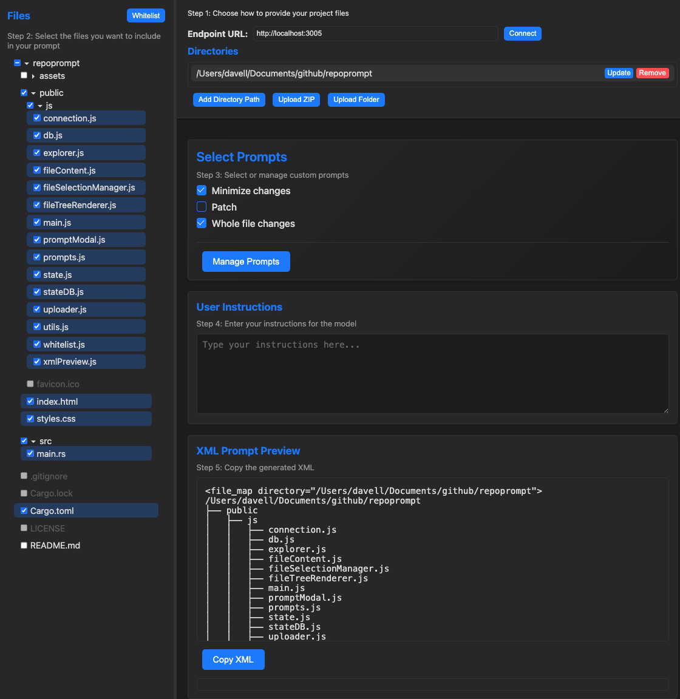

# RepoPrompt

RepoPrompt is an unofficial pure-JavaScript open-source reimplementation of [Repo Prompt](https://repoprompt.com/), now with a Rust backend. It generates an XML representation of your project files and custom prompts to copy/paste into a language model's chat interface.

A free client-side version is available at [repoprompt.netlify.app](https://repoprompt.netlify.app/), supporting direct uploads of project directories, no server required.



## Quickstart

To get started quickly using the hosted client and local Rust server:

1. Download the binary for your distribution (.amd64 for x86 CPUs, .arm64 for ARM CPUs like M-series Macs):
   ```bash
   wget https://github.com/dav-ell/repoprompt/releases/download/v1.5.0/repoprompt.amd64
   chmod +x repoprompt.amd64
   ```

2. Run it anywhere!
   ```bash
   ./repoprompt.amd64
   ```

3. (Optional for HTTPS) Generate SSL certificates and re-run. This step is required if you want to have repoprompt.netlify.app connect to your local backend.
   ```bash
   openssl genrsa -out server.key 2048
   openssl req -new -x509 -key server.key -out server.cert -days 365 -sha256 -subj "/CN=localhost"
   ```

If using [repoprompt.netlify.app](https://repoprompt.netlify.app/), set the "Endpoint URL" to `https://localhost:3000` (or `http://localhost:3000` without SSL), and follow the UI steps.

## Client

The client can also be used separately if desired. you can use the hosted version at [repoprompt.netlify.app](https://repoprompt.netlify.app/) or serve locally:

```bash
git clone https://github.com/dav-ell/repoprompt
cd public
python3 -m http.server 8000
```

Then open `http://localhost:8000` in your browser and upload a directory using the "Upload Folder" button. Make sure to set the endpoint to your locally-hosted backend in order to use the full feature set of this application. 

Note that if using the free [repoprompt.netlify.app](https://repoprompt.netlify.app/), due to browser security restrictions, you must generate SSL certificates prior to the start your backend and point the website to `https://localhost:3000` instead of `http://localhost:3000`.

## How to use the tool

1. **Endpoint URL:** Enter the server URL (e.g., `https://localhost:3000`).
2. **Connect:** Click **Connect** to link to the server.
3. **Directory Path:** Input the absolute path to your project (e.g., `/home/user/project`).
4. **File Selection:** Choose files/folders in the explorer; `.gitignore` is respected.
5. **User Instructions:** Add instructions for the model (e.g., "fix bug in feature X").
6. **Copy XML:** Click **Copy XML** to get the generated XML for your LLM.

## Custom Prompts

Manage prompts via the **Manage Prompts** button:
- Add/edit/delete prompts to e.g. force the model to output full files when making code changes, only patches, diffs with context, etc.
- Select prompts with checkboxes to include them in the final XML.

## File Tree Whitelist

- Whitelist any file extensions you may want to include as context in your prompt. Supports wildcards (e.g. "Dockerfile*"). 

## Troubleshooting

- **Connection Issues:** Check server status and URL.
- **Directory Not Loading:** Verify path and permissions; check `.gitignore`.
- **XML Not Updating:** Ensure files are selected; inspect browser console.

## License

Licensed under Apache 2.0. See [LICENSE](LICENSE) for details.
